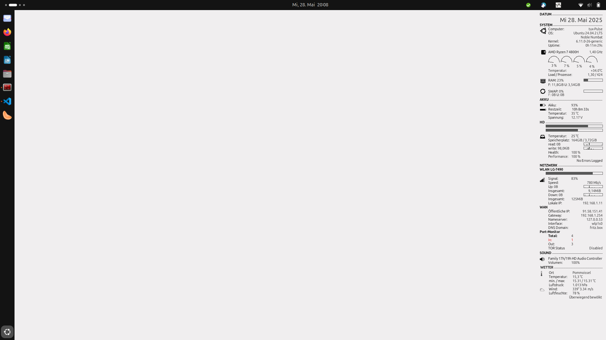

# Conky configuration file

Conky is a versatile system monitor for the desktop.

[https://github.com/brndnmtthws/conky](https://github.com/brndnmtthws/conky)

This repository provides all Conky configuration files as well as additional programs and scripts for my environment.
Here is a screenshot of my Conky installation.

## Features
* CPU (utilization, temperature)
* Battery status (charge, temperature, voltage)
* Hard drive (usage, temperature, performance)
* Network (Wi-Fi, LAN, mobile, WAN)
* Port monitor
* Tor status
* Weather  
_Some displays depend on which sensor information your system provides_

## Installation

### Conky
You can find detailed instructions on the [Conky Github page](https://github.com/brndnmtthws/conky)

To automatically start Conky, the following entries are set as automatic startup programs.  
_Conky is started and get the first weather data_

bash -c "sleep 5; conky -c ~/.conky/conkyrc"  
bash -c "sleep 2; ~/.conky/weatherload"

### Configuration files
Clone the configuration files from GitHub repository:

``
$ git clone https://github.com/frasom/conkyrc.git ~/.conky
``

The following adjustments must be made.
* Lines 75-85 adjust the number of CPU cores
* Line 127 Entering the wireless interface
* Line 140 Entering the LAN interface
* Line 152 Enter additional network interface
* Line 164 Enter mobile network interface
  
### Additives

#### Weather data

Weatherload is a script that retrieves the weather data. An OpenWeather API key is required and the coordinates of the desired location must be entered.
The individual values ​​are extracted from the weather data using the php program weater.php.

#### Hard Disk Sentinel (HDSentinel)

The hard drive status is read using Hard Disk Sentinel. [HDSentinel](https://www.hdsentinel.com/) must be installed for this to work.
The script hdhealth checks the health of the hard drive using smartctl and HDSentinel, and writes the results to a conky configuration file

Please change USERNAME in lines 5, 8, 10, 11 with your username

To update the HD status, the script "hdhealth" is added to root's crontab (every hour).

``
0 * * * *	/Path_to_the_file/hdhealth > /dev/null 2>&1
``

#### other

Additionally, the following programs are used by the configuration/scripts and must be installed

* lm-sensors (sensor used by conky)
* Hard Disk Sentinel [HDSentinel](https://www.hdsentinel.com/download.php) for hard drive health
* curl (html text converter for conky)
* Fonts used by conky (Ubuntu, OpenLogos, Poky, Weather)

